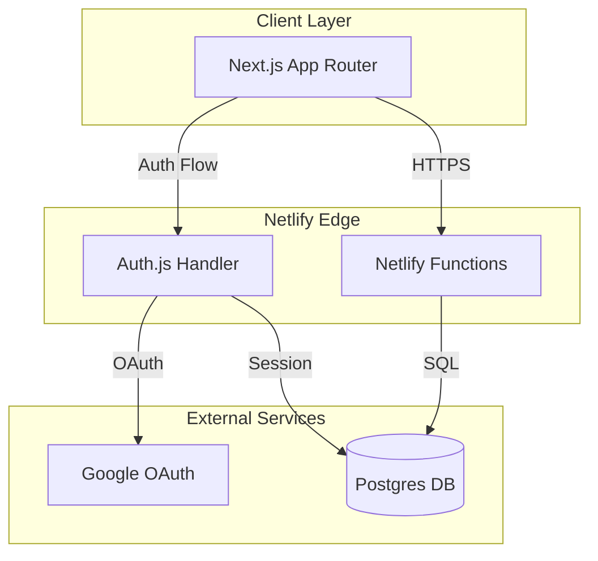
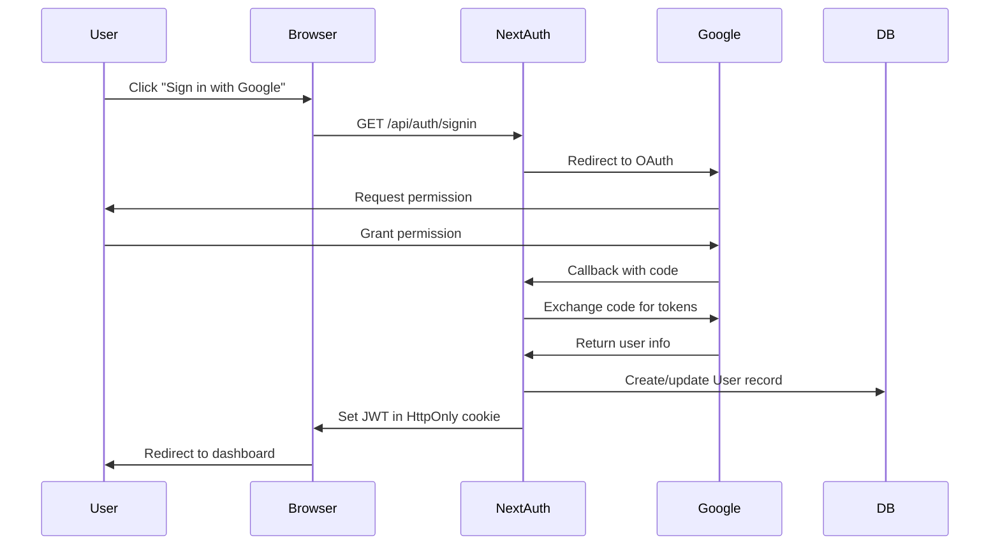

# Design Document: aGreend Skills Platform

## Overview

aGreend is a multi-tenant green skills gap intelligence platform built on Netlify with Next.js frontend and serverless functions for backend logic. The system uses Google OAuth for authentication, Postgres for data storage, and implements strict tenant isolation. The architecture follows a hierarchical skills model where company baseline skills cascade to departments and roles, with explicit department scoping for data access control.

The platform enables organizations to assess employee sustainability skills, identify gaps against role requirements, visualize analytics through dashboards, and gamify skill development through XP and leaderboards.

## Architecture

### High-Level Architecture



### Technology Stack

- **Frontend**: Next.js 14+ with App Router, React, TailwindCSS
- **Backend**: Netlify Functions (auto-converted from Next.js API routes)
- **Authentication**: Auth.js (NextAuth.js) with Google provider, JWT strategy
- **Database**: Neon or Supabase Postgres
- **ORM**: Drizzle ORM (preferred for speed) or Prisma
- **Session Storage**: JWT tokens in HttpOnly cookies (no database sessions)
- **Deployment**: Netlify hosting

### Authentication Flow



**Hackathon Simplifications:**
- Use JWT strategy (no database session table needed)
- Accept any valid Google login (no domain restrictions)
- Store companyId in JWT token for fast access
- Auto-create User record on first login

## Components and Interfaces

### Core Components

#### 1. Authentication Module

**Responsibilities:**
- Handle Google OAuth flow
- Manage session lifecycle
- Validate session cookies
- Resolve user context (company, department, role)

**Key Functions:**
```typescript
interface AuthModule {
  signIn(): Promise<void>;
  signOut(): Promise<void>;
  getSession(): Promise<Session | null>;
  validateSession(cookie: string): Promise<User | null>;
  resolveUserContext(userId: string): Promise<UserContext>;
}

interface Session {
  userId: string;
  email: string;
  expiresAt: Date;
}

interface UserContext {
  user: User;
  companies: CompanyMembership[];
  activeCompany: Company | null;
  activeDepartments: Department[];
  role: UserRole;
}
```

#### 2. Tenant Isolation Middleware

**Responsibilities:**
- Verify user membership in requested company
- Enforce companyId filtering on all queries
- Validate department access for managers
- Inject companyId into all write operations

**Key Functions:**
```typescript
interface TenantMiddleware {
  validateCompanyAccess(userId: string, companyId: string): Promise<boolean>;
  validateDepartmentAccess(userId: string, departmentId: string): Promise<boolean>;
  enforceCompanyFilter<T>(query: Query<T>, companyId: string): Query<T>;
  injectCompanyId<T>(data: T, companyId: string): T;
}
```

#### 3. Skills Hierarchy Resolver

**Responsibilities:**
- Combine company baseline, department, and role skills
- Resolve effective skill requirements for an employee
- Prevent duplicate skills across hierarchy levels
- Handle skill versioning

**Key Functions:**
```typescript
interface SkillsHierarchyResolver {
  resolveEmployeeSkills(employeeId: string): Promise<SkillRequirement[]>;
  getCompanyBaselineSkills(companyId: string): Promise<SkillRequirement[]>;
  getDepartmentSkills(departmentId: string): Promise<SkillRequirement[]>;
  getRoleSkills(roleId: string): Promise<SkillRequirement[]>;
  deduplicateSkills(skills: SkillRequirement[]): SkillRequirement[];
}

interface SkillRequirement {
  skillId: string;
  skillName: string;
  familyId: string;
  requiredLevel: 1 | 2 | 3 | 4;
  source: 'company' | 'department' | 'role';
}
```

#### 4. Assessment Engine

**Responsibilities:**
- Select 20 questions prioritized by role requirements
- Track assessment progress
- Store assessment results with history
- Link assessments to conductor

**Key Functions:**
```typescript
interface AssessmentEngine {
  startAssessment(employeeId: string, conductedBy: string): Promise<Assessment>;
  selectQuestions(employeeId: string): Promise<Question[]>;
  submitAssessment(assessmentId: string, responses: Response[]): Promise<void>;
  getAssessmentHistory(employeeId: string): Promise<Assessment[]>;
}

interface Assessment {
  id: string;
  employeeId: string;
  conductedBy: string;
  startedAt: Date;
  completedAt: Date | null;
  questions: Question[];
}

interface Question {
  id: string;
  skillId: string;
  prompt: string;
}

interface Response {
  questionId: string;
  skillId: string;
  level: 1 | 2 | 3 | 4;
}
```

#### 5. Gap Calculator

**Responsibilities:**
- Calculate gap values (required - current)
- Classify severity (Critical, Moderate, No Gap)
- Handle missing assessment data
- Aggregate gaps for analytics

**Key Functions:**
```typescript
interface GapCalculator {
  calculateEmployeeGaps(employeeId: string): Promise<SkillGap[]>;
  calculateDepartmentGaps(departmentId: string): Promise<GapSummary>;
  calculateCompanyGaps(companyId: string): Promise<GapSummary>;
  classifySeverity(gapValue: number): Severity;
}

interface SkillGap {
  employeeId: string;
  skillId: string;
  skillName: string;
  requiredLevel: number;
  currentLevel: number | null;
  gapValue: number;
  severity: Severity;
}

type Severity = 'Critical' | 'Moderate' | 'No Gap';

interface GapSummary {
  totalGaps: number;
  criticalCount: number;
  moderateCount: number;
  noGapCount: number;
  gapsByRole: Map<string, number>;
  gapsBySkillFamily: Map<string, number>;
}
```

#### 6. Dashboard Analytics

**Responsibilities:**
- Aggregate gap data for visualization
- Generate KPI cards
- Create role heatmap data
- Identify high-risk roles

**Key Functions:**
```typescript
interface DashboardAnalytics {
  getKPICards(companyId: string, departmentId?: string): Promise<KPICards>;
  getSeverityDistribution(companyId: string, departmentId?: string): Promise<Distribution>;
  getRoleHeatmap(companyId: string, departmentId?: string): Promise<HeatmapData>;
  getHighRiskRoles(companyId: string, departmentId?: string): Promise<RiskRole[]>;
}

interface KPICards {
  totalEmployees: number;
  totalGaps: number;
  criticalGaps: number;
  moderateGaps: number;
  averageGapPerEmployee: number;
}

interface Distribution {
  critical: number;
  moderate: number;
  noGap: number;
}

interface HeatmapData {
  roles: string[];
  skillFamilies: string[];
  matrix: number[][]; // gap counts
}

interface RiskRole {
  roleId: string;
  roleName: string;
  criticalGapCount: number;
  employeeCount: number;
}
```

#### 7. Gamification Engine

**Responsibilities:**
- Calculate XP based on gap closures
- Aggregate department scores
- Generate leaderboard rankings
- Track skill tree progress

**Key Functions:**
```typescript
interface GamificationEngine {
  calculateEmployeeXP(employeeId: string): Promise<number>;
  updateXPOnAssessment(employeeId: string, oldAssessment: Assessment | null, newAssessment: Assessment): Promise<void>;
  getDepartmentScores(companyId: string): Promise<DepartmentScore[]>;
  getLeaderboard(companyId: string): Promise<LeaderboardEntry[]>;
  getSkillTreeProgress(employeeId: string): Promise<SkillTreeNode[]>;
}

interface DepartmentScore {
  departmentId: string;
  departmentName: string;
  totalXP: number;
  employeeCount: number;
  averageXP: number;
}

interface LeaderboardEntry {
  rank: number;
  departmentId: string;
  departmentName: string;
  score: number;
}

interface SkillTreeNode {
  familyId: string;
  familyName: string;
  skills: SkillProgress[];
}

interface SkillProgress {
  skillId: string;
  skillName: string;
  currentLevel: number | null;
  requiredLevel: number;
  gapValue: number;
}
```

#### 8. RBAC Authorization

**Responsibilities:**
- Validate user permissions for actions
- Enforce role-based access rules
- Check department assignments for managers

**Key Functions:**
```typescript
interface RBACAuthorization {
  canCreateDepartment(userId: string, companyId: string): Promise<boolean>;
  canCreateRole(userId: string, companyId: string): Promise<boolean>;
  canCreateEmployee(userId: string, departmentId: string): Promise<boolean>;
  canConductAssessment(userId: string, employeeId: string): Promise<boolean>;
  canViewDashboard(userId: string, companyId: string, departmentId?: string): Promise<boolean>;
  canExportData(userId: string, companyId: string, departmentId?: string): Promise<boolean>;
  getUserRole(userId: string, companyId: string): Promise<UserRole>;
}

type UserRole = 'Owner' | 'Admin' | 'Manager' | 'Employee';
```

### API Endpoints

All endpoints are implemented as Netlify Functions under `/.netlify/functions/`.

#### Authentication Endpoints

```
# Standard Next.js Auth.js routes (auto-converted by Netlify)
GET  /api/auth/signin                      - Initiate Google OAuth
GET  /api/auth/callback/google             - Handle OAuth callback
POST /api/auth/signout                     - Clear session
GET  /api/auth/session                     - Get current session
```

**Hackathon Note**: Use Next.js App Router `app/api/auth/[...nextauth]/route.ts` instead of manual Netlify Functions. Netlify automatically converts these to serverless functions.

#### Company Management

```
POST /api/company                          - Create company (onboarding)
GET  /api/company                          - Get user's company info
PUT  /api/company/branding                 - Update company branding
```

**Hackathon Simplification**: Drop invitation system for demo. Users create their own company on first login.

#### Department Management

```
POST /api/departments                      - Create department
GET  /api/departments                      - List departments
GET  /api/departments/:id                  - Get department details
```

#### Role Management

```
POST /api/roles                            - Create role with auto-assigned skills
GET  /api/roles?departmentId=:id           - List roles in department
GET  /api/roles/:id                        - Get role with all skills
```

#### Employee Management

```
POST /api/employees                        - Create employee
GET  /api/employees?departmentId=:id       - List employees
GET  /api/employees/:id                    - Get employee details
DELETE /api/employees/:id                  - Soft delete employee
```

**Hackathon Simplification**: Drop employee-user linking for demo. Focus on admin creating and assessing employees.

#### Assessment Endpoints

```
GET  /api/assessment/questions?employeeId=:id - Get 20 questions
POST /api/assessment/submit                - Submit completed assessment
GET  /api/assessment/history/:employeeId   - Get assessment history
```

#### Dashboard and Analytics

```
GET  /api/dashboard?departmentId=:id       - Get dashboard data
GET  /api/analytics/gaps?departmentId=:id  - Get gap analysis
```

#### Export

```
GET  /api/export/gaps?departmentId=:id     - Export CSV
```

#### Gamification

```
GET  /api/game/tree/:employeeId            - Get skill tree
GET  /api/game/leaderboard                 - Get department leaderboard
```

#### Audit Logs

**Hackathon Simplification**: Drop audit logging for demo. Focus on core functionality.

## Data Models

### Database Schema

```typescript
// Core User and Company Tables

interface User {
  id: string; // UUID
  email: string; // unique
  name: string;
  companyId: string | null; // FK to Company (null until onboarding)
  role: 'Owner' | 'Admin' | 'Manager' | 'Employee'; // Simplified RBAC
  createdAt: Date;
}

// Required by Auth.js adapter (don't modify)
interface Account {
  id: string; // UUID
  userId: string; // FK to User
  type: string;
  provider: string;
  providerAccountId: string;
  access_token: string | null;
  expires_at: number | null;
  token_type: string | null;
  scope: string | null;
  id_token: string | null;
  session_state: string | null;
}

interface Company {
  id: string; // UUID
  name: string;
  industry: string;
  size: string;
  location: string;
  logoUrl: string | null;
  primaryColor: string | null;
  createdAt: Date;
}

**Hackathon Simplifications:**
- Removed Session table (using JWT)
- Removed CompanyUser table (role stored directly on User)
- Removed Invitation table (no invitation system for demo)
- Removed DepartmentAssignment table (simplified access control)

// Organizational Structure

interface Department {
  id: string; // UUID
  companyId: string; // FK to Company
  name: string;
  createdAt: Date;
}

interface Role {
  id: string; // UUID
  companyId: string; // FK to Company
  departmentId: string; // FK to Department
  function: string; // e.g., "Sustainability Manager" - used to lookup skills in role-defaults.json
  title: string;
  createdAt: Date;
}

**Hackathon Shortcut**: No RoleSkillRequirement table. Skills are calculated on-the-fly from role-defaults.json using the function field.

interface Employee {
  id: string; // UUID
  companyId: string; // FK to Company
  departmentId: string; // FK to Department
  roleId: string; // FK to Role
  name: string;
  isActive: boolean; // soft delete flag
  createdAt: Date;
  deactivatedAt: Date | null;
}

**Hackathon Simplification**: Removed linkedUserId (no employee self-service for demo)

// Skills and Requirements

interface SkillFamily {
  id: string; // UUID
  name: string;
  version: number;
  effectiveDate: Date;
}

interface Skill {
  id: string; // UUID
  familyId: string; // FK to SkillFamily
  name: string;
  functionTags: string[]; // for auto-assignment
  version: number;
  effectiveDate: Date;
  isSeeded: boolean; // true for platform-provided, false for custom
}

**Hackathon Shortcut**: Skills are stored in JSON files, not database. No CompanyBaselineSkill, DepartmentSkill, or RoleSkillRequirement tables.

// Assessment and Progress

interface AssessmentQuestion {
  id: string; // UUID
  skillId: string; // FK to Skill
  prompt: string;
  version: number;
}

interface EmployeeSkillAssessment {
  id: string; // UUID
  companyId: string; // FK to Company
  employeeId: string; // FK to Employee
  skillId: string; // FK to Skill
  currentLevel: 1 | 2 | 3 | 4;
  assessmentDate: Date;
  conductedBy: string; // FK to User
  createdAt: Date;
  // Multiple assessments per employee per skill allowed
}

// Gamification

interface EmployeeXP {
  id: string; // UUID
  companyId: string; // FK to Company
  employeeId: string; // FK to Employee
  xpTotal: number;
  lastUpdated: Date;
  // Unique constraint on (companyId, employeeId)
}

interface DepartmentScore {
  id: string; // UUID
  companyId: string; // FK to Company
  departmentId: string; // FK to Department
  score: number;
  lastUpdated: Date;
  // Unique constraint on (companyId, departmentId)
}

**Hackathon Simplification**: Removed AuditLog table (no audit trail for demo)
```

### Seeded Data Structure

```typescript
// Seeded data is version-controlled and shared across all companies

interface SeededSkillFamily {
  name: string;
  version: number;
  effectiveDate: Date;
}

const SKILL_FAMILIES: SeededSkillFamily[] = [
  { name: "Climate Action", version: 1, effectiveDate: new Date("2024-01-01") },
  { name: "Circular Economy", version: 1, effectiveDate: new Date("2024-01-01") },
  { name: "Sustainable Operations", version: 1, effectiveDate: new Date("2024-01-01") },
  { name: "Green Innovation", version: 1, effectiveDate: new Date("2024-01-01") },
];

interface SeededSkill {
  familyName: string;
  name: string;
  functionTags: string[];
  version: number;
  effectiveDate: Date;
}

// Example seeded skills (40-60 total)
const SEEDED_SKILLS: SeededSkill[] = [
  {
    familyName: "Climate Action",
    name: "Carbon Footprint Analysis",
    functionTags: ["Sustainability Manager", "Operations Manager"],
    version: 1,
    effectiveDate: new Date("2024-01-01"),
  },
  {
    familyName: "Climate Action",
    name: "Climate Risk Assessment",
    functionTags: ["Risk Manager", "Sustainability Manager"],
    version: 1,
    effectiveDate: new Date("2024-01-01"),
  },
  // ... 38-58 more skills
];

interface RoleSkillDefault {
  function: string;
  skillName: string;
  requiredLevel: 1 | 2 | 3 | 4;
}

// Default mappings for auto-assignment
const ROLE_SKILL_DEFAULTS: RoleSkillDefault[] = [
  { function: "Sustainability Manager", skillName: "Carbon Footprint Analysis", requiredLevel: 4 },
  { function: "Sustainability Manager", skillName: "Climate Risk Assessment", requiredLevel: 3 },
  { function: "Operations Manager", skillName: "Carbon Footprint Analysis", requiredLevel: 2 },
  // ... more mappings
];

interface SeededQuestion {
  skillName: string;
  prompt: string;
  version: number;
}

// 15-20 assessment questions
const SEEDED_QUESTIONS: SeededQuestion[] = [
  {
    skillName: "Carbon Footprint Analysis",
    prompt: "How would you rate your ability to calculate and analyze organizational carbon emissions?",
    version: 1,
  },
  // ... 14-19 more questions
];
```


## Correctness Properties

*A property is a characteristic or behavior that should hold true across all valid executions of a system—essentially, a formal statement about what the system should do. Properties serve as the bridge between human-readable specifications and machine-verifiable correctness guarantees.*

### Property 1: Session Creation Round-Trip

*For any* valid Google OAuth response, creating a session should persist user data (email, name) that can be retrieved, and the session should include an HttpOnly cookie that validates successfully.

**Validates: Requirements 2.3, 2.4, 4.1**

### Property 2: Session Invalidation

*For any* invalid or missing session cookie, protected endpoints should reject the request with an authentication error.

**Validates: Requirements 4.2**

### Property 3: Logout Clears Session

*For any* valid session, calling logout should remove the session such that subsequent requests with the same cookie are rejected.

**Validates: Requirements 4.4**

### Property 4: Company Branding Round-Trip

*For any* company with branding configuration (logo URL, primary color), storing the branding and then retrieving the company should return the same branding values.

**Validates: Requirements 3.1, 3.2, 3.3, 3.4**

### Property 5: Tenant Data Isolation

*For any* tenant-scoped database record, the record should include a companyId, and queries should only return records matching the requesting user's companyId.

**Validates: Requirements 5.1, 5.4, 5.5**

### Property 6: Unauthorized Company Access Rejection

*For any* user and company where the user is not a member, requests to access that company's data should be rejected with an authorization error.

**Validates: Requirements 5.2, 5.3**

### Property 7: Company Creation with Owner

*For any* new user creating a company, the system should create both a Company record and a CompanyUser membership with Owner role, and the user should be able to retrieve their company information.

**Validates: Requirements 6.2, 6.3, 6.5**

### Property 8: Company Baseline Skills Initialization

*For any* newly created company, the system should initialize baseline skill requirements from the seeded dataset.

**Validates: Requirements 6.4, 7.1**

### Property 9: Invitation Expiration

*For any* invitation created with a 7-day expiration, attempting to accept the invitation after the expiration date should fail, and the invitation should be marked as expired.

**Validates: Requirements 6.1.1, 6.1.3**

### Property 10: Invitation Acceptance Creates Membership

*For any* valid non-expired invitation, when a user signs in with the matching email, a CompanyUser membership should be created with the assigned role from the invitation.

**Validates: Requirements 6.1.2**

### Property 11: Invitation Revocation

*For any* pending invitation, revoking it should prevent acceptance even if the invitation has not expired.

**Validates: Requirements 6.1.4**

### Property 12: Multi-Company Context Switching

*For any* user belonging to multiple companies, selecting a company should set that company as the active context for the session, and subsequent requests should use that company context.

**Validates: Requirements 6.1.7, 6.1.8**

### Property 13: RBAC Authorization Enforcement

*For any* action requiring a specific role, users with insufficient roles should be rejected with an authorization error, while users with the required role should be allowed.

**Validates: Requirements 6.2.2, 6.2.3**

### Property 14: Department Creation Permission

*For any* user, only those with Owner or Admin roles should be able to create departments, while Manager and Employee roles should be rejected.

**Validates: Requirements 6.3.1**

### Property 15: Role Creation Permission

*For any* user, only those with Owner or Admin roles should be able to create roles, while Manager and Employee roles should be rejected.

**Validates: Requirements 6.3.2**

### Property 16: Employee Creation Permission

*For any* user with Manager role, they should only be able to create employees in departments they are assigned to, while Owners and Admins can create employees in any department.

**Validates: Requirements 6.3.3**

### Property 17: Assessment Conduct Permission

*For any* employee, Owners, Admins, and Managers with access to the employee's department should be able to conduct assessments, while other users should be rejected.

**Validates: Requirements 6.3.4**

### Property 18: Dashboard View Permission

*For any* dashboard request, Owners and Admins should see company-wide data, Managers should see only their assigned departments, and Employees should be rejected.

**Validates: Requirements 6.3.5, 6.3.6, 6.3.7**

### Property 19: Hierarchical Skills Resolution

*For any* employee, resolving their skill requirements should combine company baseline skills, department-specific skills, and role-specific skills, with duplicates removed (keeping the highest required level).

**Validates: Requirements 7.2, 7.3, 7.4, 7.5, 9.4**

### Property 20: Manager Department Access

*For any* Manager, they should have access to their assigned departments and be rejected when attempting to access departments they are not assigned to.

**Validates: Requirements 8.1.1, 8.1.2, 8.1.5**

### Property 21: Department Scoping for Admins

*For any* Owner or Admin, requesting data without a departmentId should return company-wide aggregated data, while requesting with a departmentId should return data filtered to that department.

**Validates: Requirements 8.1.3, 8.1.4**

### Property 22: Role Auto-Assignment

*For any* role created with a job function, the system should automatically assign skills matching the function tags from the seeded dataset with the default required levels.

**Validates: Requirements 9.1, 9.2**

### Property 23: Role Data Persistence

*For any* role created with function, title, and departmentId, storing the role and then retrieving it should return the same values.

**Validates: Requirements 9.3**

### Property 24: Employee Required Fields

*For any* employee creation request, the system should require name, department, and role assignment, rejecting requests missing any of these fields.

**Validates: Requirements 10.1**

### Property 25: Employee Soft Deletion

*For any* active employee, soft deleting them should set isActive to false and preserve all historical assessment data, and they should not appear in active employee lists.

**Validates: Requirements 10.3, 10.5**

### Property 26: Employee Reactivation

*For any* soft-deleted employee, reactivating them should set isActive to true and make them appear in active employee lists again.

**Validates: Requirements 10.4**

### Property 27: Employee-User Linking

*For any* employee and user with matching email, linking them should grant the user access to view their own skill tree, assessment history, and XP, but not edit their assessment data.

**Validates: Requirements 10.1.1, 10.1.2, 10.1.3, 10.1.4, 10.1.5**

### Property 28: Assessment Question Count

*For any* assessment started for an employee, the system should provide exactly 20 questions selected from the seeded dataset.

**Validates: Requirements 11.1**

### Property 29: Assessment Question Prioritization

*For any* assessment, questions should be prioritized such that skills required by the employee's role are more likely to be included than non-required skills.

**Validates: Requirements 11.2**

### Property 30: Assessment Submission Round-Trip

*For any* completed assessment with responses, submitting the assessment should persist EmployeeSkillAssessment records that can be retrieved with all required fields (companyId, employeeId, skillId, currentLevel, assessmentDate, conductedBy).

**Validates: Requirements 11.4, 11.5**

### Property 31: Assessment History Preservation

*For any* employee with multiple assessments, submitting a new assessment should create a new record without overwriting previous assessments, and all historical assessments should be retrievable.

**Validates: Requirements 11.6, 11.7, 11.1.1, 11.1.3**

### Property 32: Latest Assessment Usage

*For any* employee with multiple assessments for the same skill, the system should use the most recent assessment when displaying current skill levels and calculating gaps.

**Validates: Requirements 11.1.2, 11.1.5**

### Property 33: Assessment Abandonment Cleanup

*For any* assessment started but not completed, the partial data should not be persisted or affect gap calculations.

**Validates: Requirements 11.8**

### Property 34: Role Change Preserves Assessments

*For any* employee whose role changes, all previous assessments should be preserved and remain accessible.

**Validates: Requirements 11.1.4**

### Property 35: Gap Calculation Formula

*For any* employee with a required skill and current assessment, the gap value should equal requiredLevel minus currentLevel.

**Validates: Requirements 12.1**

### Property 36: Severity Classification

*For any* calculated gap, if gapValue >= 2 it should be classified as Critical, if gapValue == 1 as Moderate, and if gapValue <= 0 as No Gap.

**Validates: Requirements 12.2, 12.3, 12.4**

### Property 37: Missing Assessment Handling

*For any* required skill with no assessment data, the gap should be classified as Critical with gapValue equal to the requiredLevel.

**Validates: Requirements 12.5**

### Property 38: Dashboard KPI Accuracy

*For any* company or department, the dashboard KPI cards should accurately count total employees, total gaps, critical gaps, and moderate gaps based on the gap calculation rules.

**Validates: Requirements 13.1**

### Property 39: Severity Distribution Accuracy

*For any* company or department, the severity distribution should accurately count gaps by severity category.

**Validates: Requirements 13.2**

### Property 40: Department Filtering

*For any* dashboard request with a departmentId, all returned data should be filtered to only include employees in that department.

**Validates: Requirements 13.5**

### Property 41: CSV Export Completeness

*For any* CSV export request, the generated file should include all employees with assessment data, with columns for employee, department, role, skill, required level, current level, and severity.

**Validates: Requirements 14.1, 14.2, 14.5**

### Property 42: CSV Export Scoping

*For any* CSV export request, the data should be filtered by the user's companyId and optional departmentId.

**Validates: Requirements 14.3**

### Property 43: Skill Tree Grouping

*For any* employee, the skill tree should group skills by skill family and show current level, required level, and gap for each skill.

**Validates: Requirements 15.1, 15.2, 15.3, 15.4**

### Property 44: XP Calculation from Gap Closures

*For any* employee with multiple assessments, XP should increase when skill levels improve (gaps close) between assessments.

**Validates: Requirements 16.1**

### Property 45: Department Score Aggregation

*For any* department, the department score should equal the sum of XP for all employees in that department.

**Validates: Requirements 16.2**

### Property 46: Leaderboard Ranking

*For any* company, the leaderboard should rank departments by total score in descending order.

**Validates: Requirements 16.3, 16.4**

### Property 47: Leaderboard Update on Assessment

*For any* new assessment submission, the department scores and leaderboard rankings should be updated to reflect the new XP.

**Validates: Requirements 16.5**

### Property 48: Seeded Skills Availability

*For any* company, the seeded skills dataset (40-60 skills in 4 families) should be available for use in baseline, department, and role skill assignments.

**Validates: Requirements 17.1, 17.5**

### Property 49: Seeded Questions Availability

*For any* assessment, the system should have access to 15-20 seeded questions mapped to skills.

**Validates: Requirements 17.2**

### Property 50: Role Function Defaults

*For any* job function, the system should have default skill mappings with required levels for auto-assignment.

**Validates: Requirements 17.3, 17.4**

### Property 51: Validation Error Specificity

*For any* invalid input, the system should return specific validation errors for each field rather than generic error messages.

**Validates: Requirements 19.2**

### Property 52: Email Validation

*For any* email input, the system should validate it matches standard email format rules and reject invalid formats.

**Validates: Requirements 19.5**

### Property 53: Skill Level Validation

*For any* skill level input, the system should validate it is between 1 and 4 inclusive and reject values outside this range.

**Validates: Requirements 19.6**

### Property 54: Network Error Recovery

*For any* assessment submission that fails due to network error, the user's answers should be preserved to allow retry.

**Validates: Requirements 19.3**

### Property 55: Skill Versioning

*For any* seeded skill update, the system should create a new version without deleting previous versions, and companies should be able to opt-in to new versions.

**Validates: Requirements 20.1, 20.2, 20.3**

### Property 56: Assessment Data Preservation on Skill Update

*For any* company updating to a new skill version, all historical assessment data linked to previous versions should be preserved.

**Validates: Requirements 20.4**

### Property 57: Custom Skills Support

*For any* company, they should be able to add custom skills beyond the seeded dataset, and custom skills should be distinguishable from seeded skills.

**Validates: Requirements 20.5, 20.6**

### Property 58: Skill Deletion Protection

*For any* skill with associated assessment data, the system should prevent deletion of that skill.

**Validates: Requirements 20.7**

### Property 59: Audit Log Creation

*For any* assessment conducted, role skill requirement modified, or user role changed, an audit log entry should be created with userId, timestamp, action, and relevant metadata.

**Validates: Requirements 23.1, 23.2, 23.3**

### Property 60: Audit Log Retrieval

*For any* company, owners and admins should be able to retrieve audit logs for their company, and logs should be retained for 1 year.

**Validates: Requirements 23.4, 23.5**


## Error Handling

### Error Categories

#### 1. Authentication Errors

**Scenarios:**
- Google OAuth failure
- Invalid session cookie
- Expired session
- Missing session

**Handling:**
- Return 401 Unauthorized status
- Clear invalid cookies
- Provide user-friendly error messages
- Offer retry/re-login options
- Log authentication failures for security monitoring

**Example Response:**
```json
{
  "error": "AUTHENTICATION_FAILED",
  "message": "Your session has expired. Please sign in again.",
  "code": 401
}
```

#### 2. Authorization Errors

**Scenarios:**
- User lacks required role for action
- User not member of requested company
- Manager accessing unauthorized department
- Employee attempting admin action

**Handling:**
- Return 403 Forbidden status
- Specify required permission level
- Log authorization violations
- Do not expose sensitive information about what exists

**Example Response:**
```json
{
  "error": "INSUFFICIENT_PERMISSIONS",
  "message": "This action requires Owner or Admin role.",
  "required": ["Owner", "Admin"],
  "current": "Manager",
  "code": 403
}
```

#### 3. Validation Errors

**Scenarios:**
- Missing required fields
- Invalid email format
- Skill level out of range (not 1-4)
- Company name too short/long
- Invalid departmentId reference

**Handling:**
- Return 400 Bad Request status
- Provide field-specific error messages
- Include validation rules in response
- Allow partial success for batch operations

**Example Response:**
```json
{
  "error": "VALIDATION_FAILED",
  "message": "One or more fields are invalid.",
  "fields": {
    "email": "Invalid email format",
    "requiredLevel": "Must be between 1 and 4",
    "name": "Must be between 2 and 100 characters"
  },
  "code": 400
}
```

#### 4. Network and Connectivity Errors

**Scenarios:**
- Database connection failure
- Assessment submission interrupted
- External service timeout
- Partial data transmission

**Handling:**
- Implement retry logic (up to 3 attempts)
- Preserve user input for recovery
- Return 503 Service Unavailable for temporary issues
- Provide clear guidance on next steps
- Log errors for monitoring

**Example Response:**
```json
{
  "error": "NETWORK_ERROR",
  "message": "Unable to save your assessment. Your answers have been preserved. Please try again.",
  "retryable": true,
  "code": 503
}
```

#### 5. Resource Not Found Errors

**Scenarios:**
- Employee ID doesn't exist
- Department ID doesn't exist
- Role ID doesn't exist
- Company ID doesn't exist

**Handling:**
- Return 404 Not Found status
- Do not expose whether resource exists in other companies (security)
- Provide helpful suggestions

**Example Response:**
```json
{
  "error": "RESOURCE_NOT_FOUND",
  "message": "Employee not found or you don't have access.",
  "resourceType": "Employee",
  "resourceId": "emp_123",
  "code": 404
}
```

#### 6. Business Logic Errors

**Scenarios:**
- Accepting expired invitation
- Creating duplicate skill assignment
- Deleting skill with assessment data
- Reactivating non-existent employee

**Handling:**
- Return 422 Unprocessable Entity status
- Explain why the operation cannot be completed
- Suggest alternative actions

**Example Response:**
```json
{
  "error": "BUSINESS_RULE_VIOLATION",
  "message": "Cannot delete skill because it has associated assessment data.",
  "rule": "SKILL_HAS_ASSESSMENTS",
  "suggestion": "Archive the skill instead of deleting it.",
  "code": 422
}
```

#### 7. Server Errors

**Scenarios:**
- Unexpected exceptions
- Database query failures
- ORM errors
- Unhandled edge cases

**Handling:**
- Return 500 Internal Server Error status
- Log full error details with stack trace
- Display generic message to user (don't expose internals)
- Alert monitoring systems
- Include error ID for support tracking

**Example Response:**
```json
{
  "error": "INTERNAL_SERVER_ERROR",
  "message": "An unexpected error occurred. Our team has been notified.",
  "errorId": "err_abc123xyz",
  "code": 500
}
```

### Error Handling Patterns

#### Middleware Error Handler

All Netlify Functions should use a centralized error handler:

```typescript
async function errorHandler(error: Error, context: RequestContext): Promise<Response> {
  // Log error with context
  logger.error({
    error: error.message,
    stack: error.stack,
    userId: context.userId,
    companyId: context.companyId,
    endpoint: context.endpoint,
    timestamp: new Date().toISOString(),
  });

  // Classify error type
  if (error instanceof AuthenticationError) {
    return jsonResponse(401, {
      error: "AUTHENTICATION_FAILED",
      message: error.message,
    });
  }

  if (error instanceof AuthorizationError) {
    return jsonResponse(403, {
      error: "INSUFFICIENT_PERMISSIONS",
      message: error.message,
      required: error.requiredRoles,
      current: error.currentRole,
    });
  }

  if (error instanceof ValidationError) {
    return jsonResponse(400, {
      error: "VALIDATION_FAILED",
      message: "One or more fields are invalid.",
      fields: error.fieldErrors,
    });
  }

  // Default to 500 for unexpected errors
  const errorId = generateErrorId();
  await alertMonitoring(error, errorId);

  return jsonResponse(500, {
    error: "INTERNAL_SERVER_ERROR",
    message: "An unexpected error occurred. Our team has been notified.",
    errorId,
  });
}
```

#### Retry Logic for Database Operations

```typescript
async function withRetry<T>(
  operation: () => Promise<T>,
  maxAttempts: number = 3,
  delayMs: number = 100
): Promise<T> {
  let lastError: Error;

  for (let attempt = 1; attempt <= maxAttempts; attempt++) {
    try {
      return await operation();
    } catch (error) {
      lastError = error;
      if (attempt < maxAttempts && isRetryable(error)) {
        await delay(delayMs * attempt); // exponential backoff
        continue;
      }
      throw error;
    }
  }

  throw lastError!;
}

function isRetryable(error: Error): boolean {
  // Database connection errors, timeouts, etc.
  return (
    error.message.includes("connection") ||
    error.message.includes("timeout") ||
    error.message.includes("ECONNREFUSED")
  );
}
```

## Testing Strategy

### Overview

The testing strategy employs a dual approach combining unit tests for specific examples and edge cases with property-based tests for universal correctness properties. This ensures both concrete behavior validation and comprehensive input coverage.

### Property-Based Testing

#### Framework Selection

**TypeScript/JavaScript**: Use `fast-check` library for property-based testing.

```bash
npm install --save-dev fast-check @types/fast-check
```

#### Configuration

- Minimum 100 iterations per property test
- Each property test must reference its design document property
- Tag format: `Feature: agreend-skills-platform, Property {number}: {property_text}`

#### Example Property Test

```typescript
import fc from 'fast-check';
import { describe, it } from 'vitest';

describe('Feature: agreend-skills-platform, Property 35: Gap Calculation Formula', () => {
  it('should calculate gap as requiredLevel minus currentLevel for all valid levels', () => {
    fc.assert(
      fc.property(
        fc.integer({ min: 1, max: 4 }), // requiredLevel
        fc.integer({ min: 1, max: 4 }), // currentLevel
        (requiredLevel, currentLevel) => {
          const gap = calculateGap(requiredLevel, currentLevel);
          expect(gap.gapValue).toBe(requiredLevel - currentLevel);
        }
      ),
      { numRuns: 100 }
    );
  });
});
```

#### Property Test Coverage

Each of the 60 correctness properties should have a corresponding property-based test:

1. **Authentication & Session** (Properties 1-3): Test session lifecycle with random user data
2. **Branding** (Property 4): Test with random logo URLs and color values
3. **Tenant Isolation** (Properties 5-6): Test with random company and user combinations
4. **Company & Membership** (Properties 7-12): Test onboarding and invitation flows
5. **RBAC** (Properties 13-18): Test all role combinations against all actions
6. **Skills Hierarchy** (Property 19): Test with random skill assignments at all levels
7. **Department Access** (Properties 20-21): Test with random department assignments
8. **Role Management** (Properties 22-23): Test with random job functions
9. **Employee Lifecycle** (Properties 24-27): Test creation, deletion, reactivation, linking
10. **Assessment** (Properties 28-34): Test with random questions and responses
11. **Gap Calculation** (Properties 35-37): Test with all level combinations
12. **Analytics** (Properties 38-43): Test with random employee and assessment data
13. **Gamification** (Properties 44-47): Test XP and leaderboard with random assessments
14. **Seeded Data** (Properties 48-50): Test availability and consistency
15. **Validation** (Properties 51-54): Test with random invalid inputs
16. **Versioning** (Properties 55-58): Test skill updates and migrations
17. **Audit Logging** (Properties 59-60): Test log creation and retrieval

#### Smart Generators

Create custom generators for domain objects:

```typescript
// Generator for valid skill levels
const skillLevelArb = fc.integer({ min: 1, max: 4 });

// Generator for valid emails
const emailArb = fc.emailAddress();

// Generator for employee with role and department
const employeeArb = fc.record({
  id: fc.uuid(),
  name: fc.string({ minLength: 2, maxLength: 100 }),
  companyId: fc.uuid(),
  departmentId: fc.uuid(),
  roleId: fc.uuid(),
  isActive: fc.boolean(),
});

// Generator for assessment responses
const assessmentResponseArb = fc.array(
  fc.record({
    questionId: fc.uuid(),
    skillId: fc.uuid(),
    level: skillLevelArb,
  }),
  { minLength: 20, maxLength: 20 }
);

// Generator for user roles
const userRoleArb = fc.constantFrom('Owner', 'Admin', 'Manager', 'Employee');
```

### Unit Testing

#### Framework

Use Vitest for unit testing (fast, modern, TypeScript-first).

```bash
npm install --save-dev vitest
```

#### Unit Test Focus Areas

Unit tests complement property tests by covering:

1. **Specific Examples**: Concrete scenarios that demonstrate correct behavior
2. **Edge Cases**: Boundary conditions and special cases
3. **Error Conditions**: Specific error scenarios
4. **Integration Points**: Component interactions

#### Example Unit Tests

```typescript
import { describe, it, expect, beforeEach } from 'vitest';

describe('Gap Calculator', () => {
  describe('Severity Classification', () => {
    it('should classify gap of 2 as Critical', () => {
      const gap = { requiredLevel: 4, currentLevel: 2 };
      const severity = classifySeverity(gap);
      expect(severity).toBe('Critical');
    });

    it('should classify gap of 1 as Moderate', () => {
      const gap = { requiredLevel: 3, currentLevel: 2 };
      const severity = classifySeverity(gap);
      expect(severity).toBe('Moderate');
    });

    it('should classify gap of 0 as No Gap', () => {
      const gap = { requiredLevel: 3, currentLevel: 3 };
      const severity = classifySeverity(gap);
      expect(severity).toBe('No Gap');
    });

    it('should classify missing assessment as Critical', () => {
      const gap = { requiredLevel: 3, currentLevel: null };
      const severity = classifySeverity(gap);
      expect(severity).toBe('Critical');
    });
  });

  describe('Hierarchical Skills Resolution', () => {
    it('should combine company, department, and role skills', async () => {
      const employee = await createTestEmployee({
        companySkills: [{ skillId: 's1', requiredLevel: 2 }],
        departmentSkills: [{ skillId: 's2', requiredLevel: 3 }],
        roleSkills: [{ skillId: 's3', requiredLevel: 4 }],
      });

      const skills = await resolveEmployeeSkills(employee.id);

      expect(skills).toHaveLength(3);
      expect(skills).toContainEqual({ skillId: 's1', requiredLevel: 2, source: 'company' });
      expect(skills).toContainEqual({ skillId: 's2', requiredLevel: 3, source: 'department' });
      expect(skills).toContainEqual({ skillId: 's3', requiredLevel: 4, source: 'role' });
    });

    it('should deduplicate skills and keep highest required level', async () => {
      const employee = await createTestEmployee({
        companySkills: [{ skillId: 's1', requiredLevel: 2 }],
        departmentSkills: [{ skillId: 's1', requiredLevel: 3 }],
        roleSkills: [{ skillId: 's1', requiredLevel: 4 }],
      });

      const skills = await resolveEmployeeSkills(employee.id);

      expect(skills).toHaveLength(1);
      expect(skills[0]).toEqual({ skillId: 's1', requiredLevel: 4, source: 'role' });
    });
  });
});
```

### Integration Testing

#### API Endpoint Tests

Test complete request/response cycles:

```typescript
describe('Assessment API', () => {
  it('should complete full assessment flow', async () => {
    // Setup
    const { user, company, employee } = await setupTestData();
    const session = await createSession(user);

    // Start assessment
    const startResponse = await fetch('/.netlify/functions/assessment/start', {
      method: 'POST',
      headers: { Cookie: session.cookie },
      body: JSON.stringify({ employeeId: employee.id }),
    });
    expect(startResponse.status).toBe(200);
    const { assessmentId, questions } = await startResponse.json();
    expect(questions).toHaveLength(20);

    // Submit assessment
    const responses = questions.map((q) => ({
      questionId: q.id,
      skillId: q.skillId,
      level: 3,
    }));

    const submitResponse = await fetch('/.netlify/functions/assessment/submit', {
      method: 'POST',
      headers: { Cookie: session.cookie },
      body: JSON.stringify({ assessmentId, responses }),
    });
    expect(submitResponse.status).toBe(200);

    // Verify assessment was saved
    const historyResponse = await fetch(
      `/.netlify/functions/assessment/history/${employee.id}`,
      {
        headers: { Cookie: session.cookie },
      }
    );
    const history = await historyResponse.json();
    expect(history).toHaveLength(1);
    expect(history[0].conductedBy).toBe(user.id);
  });
});
```

### Test Organization

```
tests/
├── unit/
│   ├── auth/
│   │   ├── session.test.ts
│   │   └── oauth.test.ts
│   ├── skills/
│   │   ├── hierarchy.test.ts
│   │   └── gap-calculator.test.ts
│   ├── rbac/
│   │   └── authorization.test.ts
│   └── gamification/
│       ├── xp-calculator.test.ts
│       └── leaderboard.test.ts
├── property/
│   ├── session.property.test.ts
│   ├── tenant-isolation.property.test.ts
│   ├── skills-hierarchy.property.test.ts
│   ├── gap-calculation.property.test.ts
│   ├── rbac.property.test.ts
│   └── assessment.property.test.ts
├── integration/
│   ├── api/
│   │   ├── auth.integration.test.ts
│   │   ├── assessment.integration.test.ts
│   │   └── dashboard.integration.test.ts
│   └── e2e/
│       └── onboarding-flow.e2e.test.ts
└── helpers/
    ├── generators.ts
    ├── test-data.ts
    └── setup.ts
```

### Test Data Management

#### Test Database

Use a separate test database with automatic cleanup:

```typescript
import { beforeEach, afterEach } from 'vitest';

beforeEach(async () => {
  await db.migrate.latest();
  await seedTestData();
});

afterEach(async () => {
  await db.migrate.rollback();
});
```

#### Test Data Builders

Create fluent builders for test data:

```typescript
class TestEmployeeBuilder {
  private data: Partial<Employee> = {};

  withName(name: string) {
    this.data.name = name;
    return this;
  }

  inDepartment(departmentId: string) {
    this.data.departmentId = departmentId;
    return this;
  }

  withRole(roleId: string) {
    this.data.roleId = roleId;
    return this;
  }

  async build(): Promise<Employee> {
    return await createEmployee({
      name: this.data.name || 'Test Employee',
      companyId: this.data.companyId || (await createTestCompany()).id,
      departmentId: this.data.departmentId || (await createTestDepartment()).id,
      roleId: this.data.roleId || (await createTestRole()).id,
      ...this.data,
    });
  }
}

// Usage
const employee = await new TestEmployeeBuilder()
  .withName('Jane Doe')
  .inDepartment(dept.id)
  .withRole(role.id)
  .build();
```

### Continuous Integration

#### Test Execution

Run tests in CI pipeline:

```yaml
# .github/workflows/test.yml
name: Test

on: [push, pull_request]

jobs:
  test:
    runs-on: ubuntu-latest
    steps:
      - uses: actions/checkout@v3
      - uses: actions/setup-node@v3
        with:
          node-version: '18'
      - run: npm ci
      - run: npm run test:unit
      - run: npm run test:property
      - run: npm run test:integration
```

#### Coverage Requirements

- Unit test coverage: minimum 80%
- Property test coverage: all 60 properties must have tests
- Integration test coverage: all API endpoints must have tests

### Testing Best Practices

1. **Isolation**: Each test should be independent and not rely on other tests
2. **Clarity**: Test names should clearly describe what is being tested
3. **Speed**: Unit and property tests should run quickly (< 5 minutes total)
4. **Determinism**: Tests should produce consistent results
5. **Maintainability**: Use helpers and builders to reduce duplication
6. **Documentation**: Complex test scenarios should include comments explaining the setup

